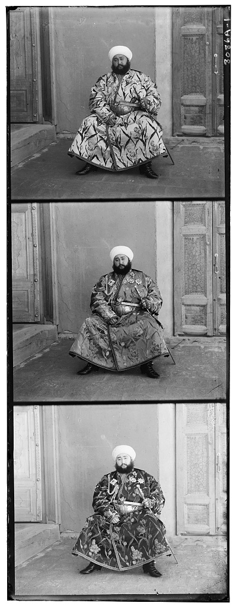
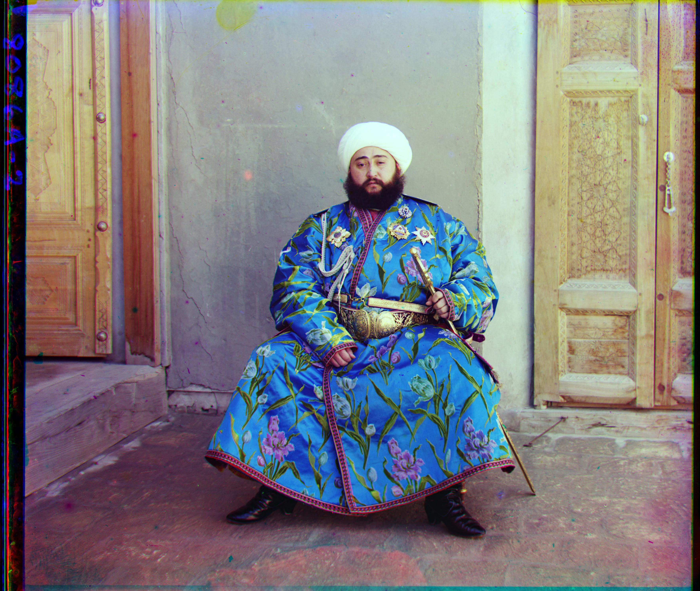

# Prokudin_Gorsky
This script takes the Prokudin Gorsky images taken in the early 1900s. These images create colorized images by taking 3 separate RGB exposures and combining them into a single image. The script below does this automatically by taking 3 channel black and white images as seen here





and converts them into a single colorized image




The script uses a pyramid alignment strategy on gradient detection. This allows for large TIFF files to be aligned in a relatively short amount of time (under 1 minute) while ensuring high quality of alignment in dense images. Additionally, border detection ensures that images are cropped prior to alignment to decrease the size of the image going into alignment and provide a more aesthetic final image. 


## Usage

### Dependencies
Install the required packages with:
````pip install numpy scikit-image matplotlib```

### Running the Script
Open `colorize_prokudin_gorsky.py` and set the input and output paths at the bottom of the file:
```python
INPUT_PATH = "path/to/your/input.tif"
OUTPUT_PATH = "path/to/your/output.jpg"
```
Then run:
```python colorize_prokudin_gorsky.py```

### Input Format
The script expects a single `.tif` file containing three equal-height grayscale strips stacked vertically in order: Blue, Green, Red. This is the standard format for digitized Prokudin-Gorsky glass plate scans, available from the [Library of Congress](https://www.loc.gov/collections/prokudin-gorsky/).
